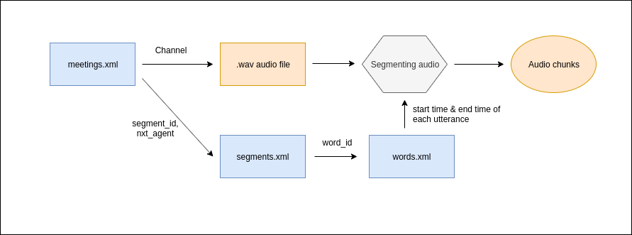

AudioPreprocessing - AMI corpus
======================================

This program processes the **AMI corpus** dataset of meetings in order to create segmented audio files for each speaker by referencing the annotations of the data. 


## Prerequisites

* Download the corpus from <a target="_blank" href="http://groups.inf.ed.ac.uk/ami/download/">here</a>
* Download the public manual annotations <a target="_blank" href="http://groups.inf.ed.ac.uk/ami/AMICorpusAnnotations/ami_public_manual_1.6.2.zip/">here</a>
* Set the path parameters in the config files as follows,
    ```
  "directories": {
      "Audio": {
        "type": "<DOWNLOADED_AUDIO_TYPE>",
        "path": "<AMI_CORPUS_PATH>"
      },
      "Segments": {
        "path": "<PATH_OF_SEGMENTS_FOLDER_IN_PUBLIC_MANUAL>"
      },
      "Words": {
        "path": "<PATH_OF_WORDS_FOLDER_IN_PUBLIC_MANUAL">
      },
      "Meetings": {
        "path": "<PATH_OF_MEETINGS_XML_IN_PUBLIC_MANUAL">
      }
    }
  },
  "OutputFolder": {
    "path": "<PATH_OF_THE_OUTPUT_FOLDER>"
  }
   ```
  
## Preprocessing structure



## How to use

run 'Segment_audio.py'